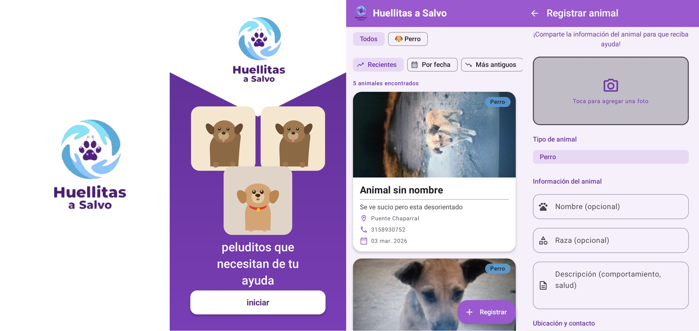

# 🐾 Huellitas

Aplicación móvil Android para el registro y visualización de animales callejeros. Permite a los usuarios reportar avistamientos de animales en situación de calle, incluyendo fotos, ubicación y datos de contacto para facilitar su rescate y adopción.

## Capturas de pantalla



## Características

- **Splash screen animado** con Lottie
- **Onboarding** de bienvenida e introducción (solo en primer inicio)
- **Autenticación real** contra backend PHP con contraseñas hasheadas (bcrypt)
- **Registro de administradores** con nombre, apellidos, correo y contraseña
- **Cierre de sesión** con limpieza de back stack y retorno al feed principal
- **Panel de administración** protegido por autenticación real
- **Listado de animales** con filtros y ordenamiento (Recientes, Por fecha, Más antiguos)
- **Registro de animales** con nombre, tipo, raza, descripción, ubicación y contacto
- **Captura de fotos** con CameraX integrada en la app
- **Subida de imágenes** al servidor
- **Zoom de imágenes** en diálogo ampliado
- **Navegación fluida** con animaciones de transición entre pantallas
- **Compatibilidad con modo oscuro** — forzado de tema claro para dispositivos Xiaomi/MIUI/Samsung

## Arquitectura

El proyecto sigue el patrón **MVVM** (Model-View-ViewModel):

```
com.example.huellitas/
├── model/              # Modelos de datos (Animal, TipoAnimal, OpcionFiltro)
├── navigation/         # Rutas y NavHost de navegación
├── network/            # Retrofit client, ApiService y DTOs (LoginRequest, UsuarioDto, etc.)
├── repository/         # Repositorio de datos (AnimalRepository, AuthRepository)
├── ui/
│   ├── components/     # Componentes reutilizables (AnimalCard, FilterChipRow, etc.)
│   ├── screens/
│   │   ├── admin/      # Login, registro de usuario, tutorial admin y panel administrativo
│   │   ├── camera/     # Pantalla de cámara (CameraX)
│   │   ├── home/       # Lista principal de animales
│   │   ├── onboarding/ # Bienvenida e introducción
│   │   ├── registration/ # Formulario de registro de animal
│   │   └── splash/     # Pantalla de carga con Lottie
│   └── theme/          # Tema Material 3 de la app
├── viewmodel/          # ViewModels (AnimalListViewModel, AnimalRegistroViewModel, AuthViewModel)
└── MainActivity.kt     # Actividad principal (single activity)
```

## Tecnologías utilizadas

| Tecnología | Uso |
|---|---|
| **Kotlin** | Lenguaje principal |
| **Jetpack Compose** | UI declarativa |
| **Material 3** | Diseño y componentes visuales |
| **Navigation Compose** | Navegación entre pantallas |
| **Retrofit 2** | Consumo de API REST |
| **OkHttp** | Cliente HTTP con logging |
| **Gson** | Serialización/deserialización JSON |
| **Coil** | Carga de imágenes asíncronas |
| **Lottie** | Animaciones en splash screen |
| **CameraX** | Captura de fotos |
| **Coroutines** | Programación asíncrona |
| **ViewModel** | Gestión del estado de la UI |

## Backend

La app se conecta a un backend PHP alojado en un servidor web:

- **Debug**: `http://10.0.2.2/huellitas/` (XAMPP local vía emulador)
- **Release**: `https://webculmapp.com/huellitas/` (HostGator)

### Endpoints principales

| Método | Endpoint | Descripción |
|---|---|---|
| POST | `/api/auth/login.php` | Iniciar sesión con correo y contraseña |
| POST | `/api/auth/registrar.php` | Registrar un nuevo usuario administrador |
| GET | `/api/animales/listar.php` | Listar animales con paginación, filtros y ordenamiento |
| POST | `/api/animales/crear.php` | Registrar un nuevo animal |
| POST | `/api/animales/subir_imagen.php` | Subir imagen de un animal |

## Flujo de autenticación

```
┌─────────────┐     ┌──────────────────┐     ┌────────────────┐     ┌──────────────┐
│  Login      │────▶│  Backend PHP     │────▶│  Tutorial      │────▶│  Panel       │
│  (correo +  │     │  password_verify  │     │  (6 pasos,     │     │  Admin       │
│  contraseña)│     │  bcrypt           │     │  solo 1ª vez)  │     │  (dashboard) │
└─────────────┘     └──────────────────┘     └────────────────┘     └──────┬───────┘
       ▲                                                                    │
       │            ┌──────────────────┐                          Cerrar sesión
       │◀───────────│  Registro        │                                    │
       │  ¿Ya       │  (nombre,        │                                    ▼
       │  tienes    │  apellidos,      │                            ┌──────────────┐
       │  cuenta?   │  correo,         │                            │  Feed        │
       │            │  contraseña)     │                            │  principal   │
       │            └──────────────────┘                            └──────────────┘
```

### Detalles técnicos

- **Login**: Valida credenciales contra `POST /api/auth/login.php`. El backend usa `password_verify()` con hashes bcrypt.
- **Registro**: Envía datos a `POST /api/auth/registrar.php`. El backend hashea con `password_hash($pwd, PASSWORD_BCRYPT)` y asigna `rol_id = 1` (Admin).
- **Cerrar sesión**: Botón en el `TopAppBar` del panel admin con icono `ExitToApp`. Navega al feed principal limpiando el back stack (`popUpTo` con `inclusive = true`).
- **Estado**: Gestionado por `AuthViewModel` con el sealed class `EstadoAuth` (Inactivo → Cargando → Éxito/Error).


## Requisitos

- **Android Studio** Ladybug o superior
- **JDK 11+**
- **Android SDK 24** (mínimo) — **SDK 36** (target)
- Servidor XAMPP (para desarrollo local) o acceso al backend en producción

## Instalación

1. Clona el repositorio:
   ```bash
   git clone https://github.com/Alfredogc21/huellitas.git
   ```
2. Abre el proyecto en **Android Studio**.
3. Sincroniza Gradle y espera a que descargue las dependencias.
4. **(Opcional)** Para desarrollo local, levanta XAMPP y copia la carpeta `huellitas/` en `C:\xampp\htdocs\huellitas`.
5. Importa el script SQL desde `huellitas/database/script_huellitas.txt` en phpMyAdmin.
6. Ejecuta la app en un emulador o dispositivo físico.

## Configuración de la URL base

La URL del backend se configura en [app/build.gradle.kts](app/build.gradle.kts):

- **Debug** — se conecta automáticamente al servidor local (`10.0.2.2`)
- **Release** — apunta al dominio de producción

Para cambiar la URL de producción, edita el `buildConfigField` en el bloque `defaultConfig`.

## Backend PHP — Estructura

Ubicación local: `C:\xampp\htdocs\huellitas`

```
huellitas/
├── api/
│   ├── animales/       # Endpoints CRUD de animales (listar, crear, subir_imagen, etc.)
│   ├── auth/           # Endpoints de autenticación (login.php, registrar.php)
│   ├── estados_animal/ # Endpoints de estados de animal
│   └── tipos_animal/   # Endpoints de tipos de animal
├── config/             # Conexión a BD (Database.php) y variables de entorno (env.php)
├── database/           # Scripts SQL (script_huellitas.txt, antoni84_huellitas_db.sql)
├── helpers/            # Utilidades (Response.php — respuestas JSON estandarizadas)
├── models/             # Modelos de datos (Animal.php, Usuario.php, TipoAnimal.php, etc.)
├── uploads/            # Imágenes subidas por los usuarios
└── .htaccess           # Seguridad: bloquea acceso directo a config/, models/, helpers/
```

## Base de datos

La base de datos MySQL (`huellitas_db`) incluye 6 tablas normalizadas hasta 3FN:

| Tabla | Descripción |
|---|---|
| `roles` | Catálogo de roles de usuario (Admin) |
| `usuarios` | Usuarios del sistema con autenticación bcrypt |
| `tipos_animal` | Catálogo de tipos (Perro, Gato, Otro) |
| `estados_animal` | Catálogo de estados (Activo, Adoptado, Inactivo) |
| `animales` | Tabla principal de animales registrados |
| `imagenes_animal` | Imágenes asociadas a animales (1:N) |

### Diagrama de relaciones

```
roles (1) ─────────── (N) usuarios
                              │
                             (1)  ← nullable (NULL = usuario público)
                              │
tipos_animal (1) ──── (N) animales (N) ──── (1) estados_animal
                              │
                             (1)
                              │
                       imagenes_animal (N)
```

- `animales.id_usuario` es **nullable**: `NULL` cuando un usuario público registra un animal, con valor cuando lo hace un admin autenticado.
- `ON DELETE SET NULL` protege los registros de animales si se elimina un usuario.

Los scripts SQL se encuentran en `huellitas/database/`.

### Credenciales por defecto

| Campo | Valor |
|---|---|
| Correo | `admin@gmail.com` |
| Contraseña | `admin` |

## Versión

- **v1.1.0** — Compatibilidad con modo oscuro y corrección de warnings con Sistema de autenticación completo:
  - Tema claro forzado en toda la app (`HuellitasTheme` siempre usa `LightColorScheme`)
  - `android:forceDarkAllowed="false"` en el manifest para bloquear Force Dark de Xiaomi/MIUI/Samsung
  - `window.decorView.isForceDarkAllowed = false` en `MainActivity` como refuerzo
  - Inputs de login y registro con colores que no son blanco ni negro puro para evitar inversión de MIUI
  - Cierre de sesión desde el panel admin con limpieza de back stack
  - Corrección de 5 warnings de iconos deprecados → migrados a `Icons.AutoMirrored.Outlined.*`
    - `Send`, `TrendingUp`, `TrendingDown`, `List`, `ArrowBack`, `ExitToApp`
  - Inicio de sesión y registro de usuarios contra backend PHP con contraseñas hasheadas (bcrypt)
  - Nuevas tablas `roles` y `usuarios` en la base de datos, relacionadas con `animales` vía FK nullable
  - Pantallas de login y registro con validación en tiempo real y mensajes de error visibles
  - Tutorial de administración con 6 pasos interactivos
  - Panel administrativo con dashboard de estadísticas
- **v1.0.0** — Primera versión con registro, listado y captura de fotos de animales callejeros

